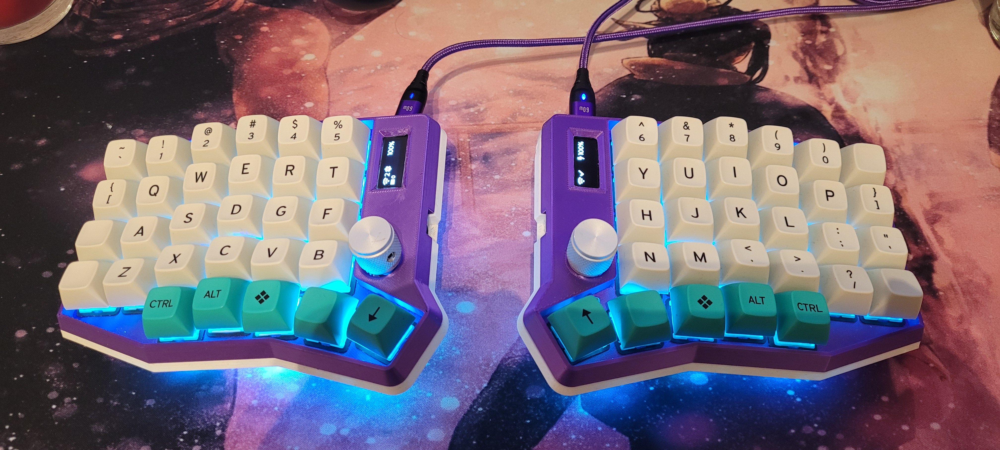

  <h1>Sofle RGB Wireless Mechanical Keyboard</h1>
  <h5>ZMK Config for Sofle RGB</h5>

## Parts list

- [Sofle RGB](https://github.com/josefadamcik/SofleKeyboard)
- 2 x [nice!nano microcontrollers](https://nicekeyboards.com/nice-nano/)
- 2 x ssd1306 128x32 OLED display modules
- [Vektor case](https://www.diykeyboards.com/parts/cases/made-to-order-cases/product/sofle-vektor-case)
- 2 x Glorious GMMK Pro Rotary Knobs
- 2 x LiPo 4000Ah 104080 Batteries
- 58 x Boba U4T
- 58 x MT3 Keycaps

## License

[MIT](https://choosealicense.com/licenses/mit/)
